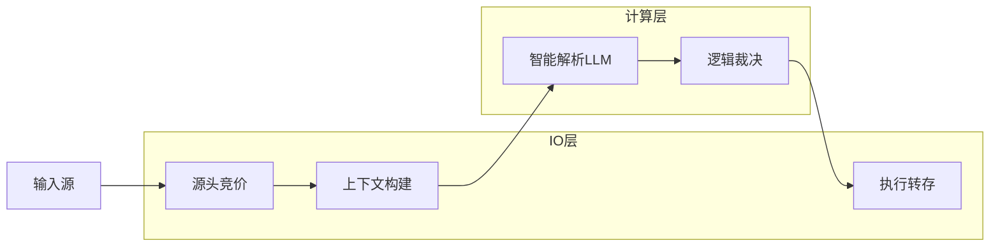
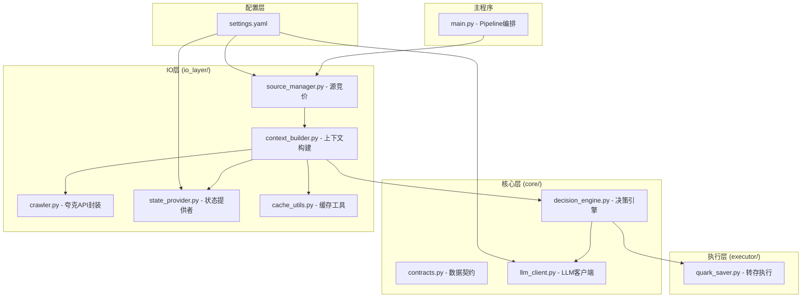
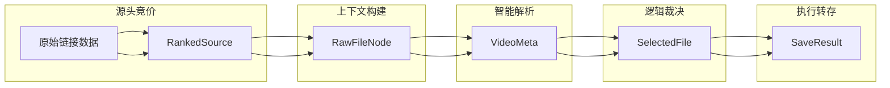
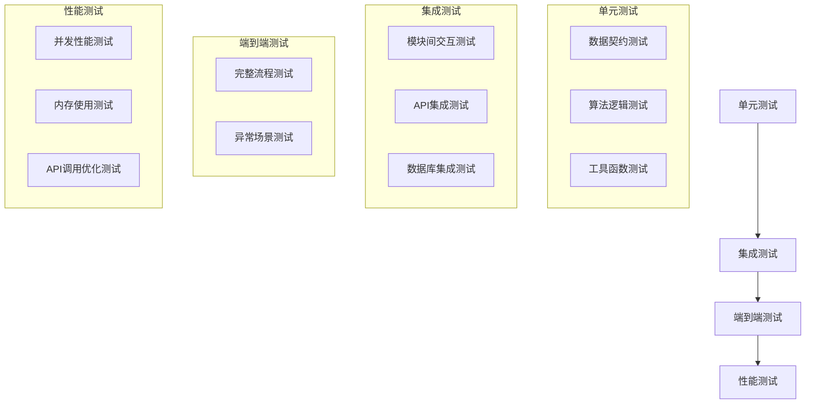
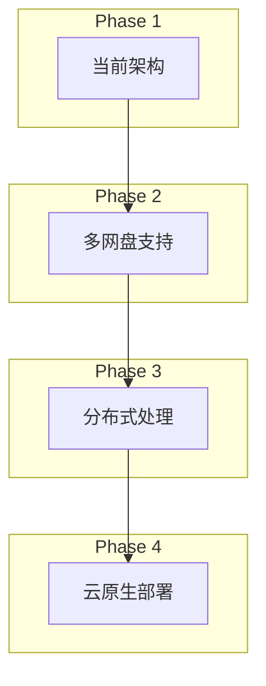

# 设计文档 - 智能媒体资源治理系统重构

## 概述

本设计文档基于v4.0架构设计，将现有ResourceOptimizer项目重构为高内聚、低耦合的智能媒体资源治理系统。系统采用Pipeline + Map-Reduce + Context Injection模式，专为NAS低CPU环境和SiliconFlow API限制优化，实现Token极致节省和高效的资源处理。

### 核心设计原则

1. **IO/计算分离**: 纯净架构，核心决策模块只处理纯净数据
2. **单向流动**: Pipeline模式确保数据流向清晰
3. **Map-Reduce**: 并行处理与聚合决策相结合
4. **Context Injection**: 通过上下文注入提高识别准确率
5. **Token经济性**: 多层过滤减少API调用

## 架构设计

### 系统流程图



### 模块架构图



## 组件和接口

### 核心数据契约 (core/contracts.py)

```python
from dataclasses import dataclass, field
from typing import List, Set, Optional, Dict

@dataclass
class RawFileNode:
    """原子节点 - 扁平化后的文件信息"""
    file_id: str              # 唯一指纹 (用于去重)
    filename: str
    size: int
    full_path: str            # 完整路径 /文件夹/S01/文件.mp4
    share_token: str          # 所属分享链接
    source_context: str       # 注入的来源标题 (如 "[4K Remux] 庆余年2")

@dataclass
class SeriesState:
    """状态快照 - 上帝视角"""
    tmdb_total_aired: Set[int]  # TMDB已播出集数
    local_existing: Set[int]    # 本地已存储集数
    last_updated: float = 0.0   # 缓存标记

@dataclass
class VideoMeta:
    """中间态 - LLM解析后的元数据"""
    title_cn: str
    season: int
    episode: int
    resolution: str
    quality_score: int          # 0-100
    is_valid_video: bool

@dataclass
class AnalysisContext:
    """输入包 - 决策引擎的唯一输入"""
    standard_title: str         # 标准剧名 (唯一键)
    candidates: List[RawFileNode]
    state: SeriesState
```

### 源数据预处理模块 (io_layer/source_manager.py)

**职责**: 极速剔除劣质源，降低后续IO和API压力

**核心算法**: 源头竞价 (Source Bidding)
- 关键词打分: Remux/BluRay (+50), 4K/2160p (+30), 1080p (+10), 720p/预告 (-100)
- 排序与截断: 按分数降序，仅取Top 3
- 日志记录: 记录被丢弃的低分源

**接口设计**:
```python
class SourceManager:
    def __init__(self, weights_config: Dict[str, int])
    def rank_sources(self, sources: Dict[str, List[str]]) -> List[RankedSource]
    def _calculate_source_score(self, title: str) -> int
```

### 上下文构建模块 (io_layer/context_builder.py)

**职责**: 爬虫、去重、状态查询 - 最重的IO环节

**优化策略**:
1. **爬取与注入**: 遍历Top 3链接，展平目录，将链接标题注入source_context
2. **物理过滤**: 丢弃<200MB文件及非视频后缀
3. **指纹去重**: 维护seen_file_ids集合，跳过重复文件
4. **状态查询**: 带缓存的TMDB和本地状态查询 (TTL=12小时)

**接口设计**:
```python
class ContextBuilder:
    def __init__(self, crawler: Crawler, state_provider: StateProvider)
    def build(self, title: str, ranked_sources: List[RankedSource]) -> AnalysisContext
    def _physical_filter(self, files: List[RawFileNode]) -> List[RawFileNode]
    def _deduplicate_files(self, files: List[RawFileNode]) -> List[RawFileNode]
```

### LLM智能解析模块 (core/llm_client.py)

**职责**: Map阶段 - 智能解析视频元数据

**技术规格**:
- 依赖: SiliconFlow Qwen-3-8B
- 并发控制: Semaphore(4) 严格限制
- 容错机制: 指数退避重试，熔断保护

**优化的Prompt模板**:
```
你是一个视频元数据解析专家。
【全局来源信息】: "{source_context}"
【文件特征】: "{full_path}" ({size_mb}MB)
任务: 提取元数据并评分。
评分标准(0-100): 4K/Remux高分, 1080p中等, 720p/广告低分。
如果无法确定集数或非正片，is_valid_video设为false。
输出JSON: {"season": int, "episode": int, "quality_score": int, "is_valid_video": bool, "resolution": "str"}
```

**接口设计**:
```python
class LLMClient:
    def __init__(self, api_key: str, model: str, max_concurrency: int = 4)
    async def parse_video_metadata(self, file_node: RawFileNode) -> VideoMeta
    def _build_prompt(self, file_node: RawFileNode) -> str
    def _parse_response(self, response: str) -> VideoMeta
```

### 逻辑裁决模块 (core/decision_engine.py)

**职责**: Reduce阶段 - 纯逻辑计算

**核心算法**:
1. **确定缺口**: Needed = State.tmdb - State.local
2. **分组竞价**: 将解析结果按SxxExx分组
3. **择优选择**: 遍历Needed中的每一集，选出Score最高的候选
4. **洗版支持**: 可选的本地文件质量比较

**接口设计**:
```python
class DecisionMaker:
    def decide(self, context: AnalysisContext, parsed_results: List[VideoMeta]) -> List[SelectedFile]
    def _identify_gaps(self, state: SeriesState) -> Set[int]
    def _group_by_episode(self, results: List[VideoMeta]) -> Dict[str, List[VideoMeta]]
    def _select_best_quality(self, candidates: List[VideoMeta]) -> VideoMeta
```

### 执行器模块 (executor/quark_saver.py)

**职责**: 副作用处理 - 批量转存

**功能特性**:
- 批量调用转存接口
- 容错处理和失败记录
- 进度跟踪和状态报告

**接口设计**:
```python
class QuarkSaver:
    def __init__(self, client: QuarkClient)
    def batch_save(self, selected_files: List[SelectedFile]) -> SaveResult
    def _save_single_file(self, file: SelectedFile) -> bool
    def _log_failed_tasks(self, failures: List[FailedTask]) -> None
```

## 数据模型

### 文件处理流程中的数据转换



### 缓存数据模型

```python
@dataclass
class CacheEntry:
    """缓存条目"""
    key: str
    data: Any
    timestamp: float
    ttl: int  # 生存时间(秒)
    
    def is_expired(self) -> bool:
        return time.time() - self.timestamp > self.ttl
```

## 正确性属性

*属性是一个特征或行为，应该在系统的所有有效执行中保持为真——本质上是关于系统应该做什么的正式声明。属性作为人类可读规范和机器可验证正确性保证之间的桥梁。*

基于需求分析，以下是系统的核心正确性属性：

### 属性 1: 数据契约一致性
*对于任何* 模块间的数据传递，所有传递的数据都应该符合定义的数据契约类型
**验证: 需求 2.2**

### 属性 2: 数据完整性验证
*对于任何* 创建的数据契约实例，所有必需字段都应该被正确定义且非空
**验证: 需求 2.4**

### 属性 3: 源评分一致性
*对于任何* 包含特定关键词的源标题，评分结果应该与配置的权重规则一致
**验证: 需求 3.1, 3.2**

### 属性 4: 源排序和截断
*对于任何* 源列表，排序后的结果应该按分数降序排列，且输出长度不超过3个
**验证: 需求 3.3**

### 属性 5: 源丢弃日志记录
*对于任何* 被丢弃的低分源，系统应该在日志中记录相应的丢弃信息
**验证: 需求 3.4**

### 属性 6: 上下文注入完整性
*对于任何* 爬取的文件节点，都应该包含正确的源上下文信息
**验证: 需求 4.1**

### 属性 7: 文件过滤规则
*对于任何* 过滤后的文件列表，所有文件都应该满足大小≥200MB且为视频格式的要求
**验证: 需求 4.2**

### 属性 8: 文件去重唯一性
*对于任何* 去重处理后的文件列表，不应该存在重复的file_id
**验证: 需求 4.3**

### 属性 9: 缓存命中优化
*对于任何* 相同的查询请求，第二次查询应该使用缓存而不是发起新的API调用
**验证: 需求 4.4**

### 属性 10: 上下文构建完整性
*对于任何* 构建的AnalysisContext，都应该包含candidates和state两个必需字段
**验证: 需求 4.5**

### 属性 11: LLM API调用正确性
*对于任何* 视频文件解析请求，都应该调用SiliconFlow API的正确端点
**验证: 需求 5.1**

### 属性 12: 并发控制限制
*对于任何* 时刻，LLM解析的并发线程数都不应该超过4个
**验证: 需求 5.2**

### 属性 13: 提示词模板一致性
*对于任何* 生成的提示词，都应该符合预定义的极简模板格式
**验证: 需求 5.3**

### 属性 14: 重试机制指数退避
*对于任何* LLM解析失败，重试间隔应该按指数退避模式递增
**验证: 需求 5.4**

### 属性 15: 解析结果类型一致性
*对于任何* LLM解析的返回结果，都应该是VideoMeta类型的数据结构
**验证: 需求 5.5**

### 属性 16: 缺口计算正确性
*对于任何* 剧集状态，缺口计算应该等于TMDB已播出集数与本地已存储集数的差集
**验证: 需求 6.1**

### 属性 17: 分组格式一致性
*对于任何* 解析结果的分组，都应该按照SxxExx格式进行正确分组
**验证: 需求 6.2**

### 属性 18: 质量择优选择
*对于任何* 缺失集数，选择的候选文件应该是该集数中质量分数最高的
**验证: 需求 6.3**

### 属性 19: 洗版阈值判断
*对于任何* 洗版场景，只有当候选文件质量分数超过本地文件分数加阈值时才应该被选择
**验证: 需求 6.4**

### 属性 20: 批量转存操作
*对于任何* 转存任务列表，都应该通过批量接口而不是单个接口进行调用
**验证: 需求 7.1**

### 属性 21: 转存失败日志
*对于任何* 转存失败的文件，都应该在日志文件中记录详细的失败信息
**验证: 需求 7.2**

### 属性 22: 转存结果统计
*对于任何* 完成的转存操作，返回的统计信息都应该包含成功数、失败数等必需字段
**验证: 需求 7.4**

### 属性 23: 权重配置影响
*对于任何* 权重配置的变更，都应该正确影响后续的评分计算结果
**验证: 需求 8.2**

### 属性 24: 参数配置生效
*对于任何* 系统参数的配置变更，都应该在相应的功能模块中正确生效
**验证: 需求 8.4**

### 属性 25: 日志模块使用
*对于任何* 日志记录操作，都应该使用Python logging模块而不是print语句
**验证: 需求 9.1**

### 属性 26: 日志级别正确性
*对于任何* 日志记录，都应该根据事件类型使用正确的日志级别(INFO/WARNING/ERROR)
**验证: 需求 9.2**

### 属性 27: 熔断机制触发
*对于任何* API调用，连续10次失败后应该触发熔断机制中止任务
**验证: 需求 9.3**

### 属性 28: 性能监控记录
*对于任何* 关键操作，都应该记录执行时间和资源消耗等性能指标
**验证: 需求 9.4**

### 属性 29: 缓存TTL过期
*对于任何* TMDB查询缓存，都应该在12小时后自动过期
**验证: 需求 10.1**

### 属性 30: 缓存刷新机制
*对于任何* 过期的缓存条目，都应该在下次访问时自动刷新数据
**验证: 需求 10.3**

### 属性 31: 缓存降级机制
*对于任何* 缓存失效的情况，都应该降级到直接API调用模式
**验证: 需求 10.4**

<function_calls>
<invoke name="prework">
<parameter name="featureName">media-resource-governance-refactor


## 错误处理

### 错误分类

1. **网络错误**: API调用失败、超时
2. **数据错误**: 解析失败、格式不正确
3. **业务错误**: 链接失效、权限不足
4. **系统错误**: 资源耗尽、并发冲突

### 错误处理策略

#### 1. 重试机制
```python
# 指数退避重试
class RetryStrategy:
    def __init__(self, max_retries: int = 5, base_delay: float = 1.0):
        self.max_retries = max_retries
        self.base_delay = base_delay
    
    def calculate_delay(self, attempt: int) -> float:
        return self.base_delay * (2 ** attempt)
```

#### 2. 熔断保护
```python
class CircuitBreaker:
    def __init__(self, failure_threshold: int = 10):
        self.failure_count = 0
        self.failure_threshold = failure_threshold
        self.is_open = False
    
    def record_failure(self):
        self.failure_count += 1
        if self.failure_count >= self.failure_threshold:
            self.is_open = True
            raise CircuitBreakerOpenError("熔断器已打开")
```

#### 3. 降级策略
- 缓存失效 → 直接API调用
- LLM解析失败 → 使用规则解析
- 批量操作失败 → 降级为单个操作

#### 4. 错误日志
```python
# 结构化错误日志
logger.error(
    "API调用失败",
    extra={
        "error_type": "NetworkError",
        "api_endpoint": endpoint,
        "retry_count": retry_count,
        "error_message": str(e)
    }
)
```

### 错误恢复

1. **自动恢复**: 重试、降级、缓存
2. **手动介入**: 记录失败任务到failed_tasks.log
3. **状态保存**: 支持断点续传

## 测试策略

### 测试层次



### 单元测试

**测试框架**: pytest

**测试覆盖**:
- 数据契约的序列化/反序列化
- 评分算法的正确性
- 过滤和去重逻辑
- 缓存机制的TTL和刷新

**示例测试**:
```python
def test_source_scoring():
    """测试源评分算法"""
    manager = SourceManager(weights_config)
    source = {"title": "[4K Remux] 测试影片"}
    score = manager._calculate_source_score(source["title"])
    assert score >= 80  # 4K + Remux 应该得高分

def test_file_deduplication():
    """测试文件去重"""
    builder = ContextBuilder(crawler, state_provider)
    files = [
        RawFileNode(file_id="123", ...),
        RawFileNode(file_id="123", ...),  # 重复
        RawFileNode(file_id="456", ...)
    ]
    result = builder._deduplicate_files(files)
    assert len(result) == 2  # 应该只保留2个
    assert len(set(f.file_id for f in result)) == 2  # file_id唯一
```

### 属性测试

**测试框架**: Hypothesis (Python的属性测试库)

**测试配置**: 每个属性测试最少100次迭代

**测试标签格式**: `# Feature: media-resource-governance-refactor, Property {number}: {property_text}`

**示例属性测试**:
```python
from hypothesis import given, strategies as st

@given(st.lists(st.integers(min_value=1, max_value=100)))
def test_gap_calculation_property(aired_episodes):
    """
    属性测试: 缺口计算正确性
    Feature: media-resource-governance-refactor, Property 16: 缺口计算正确性
    """
    local_episodes = aired_episodes[:len(aired_episodes)//2]
    state = SeriesState(
        tmdb_total_aired=set(aired_episodes),
        local_existing=set(local_episodes)
    )
    
    decision_maker = DecisionMaker()
    gaps = decision_maker._identify_gaps(state)
    
    # 验证缺口 = 已播出 - 本地已有
    expected_gaps = set(aired_episodes) - set(local_episodes)
    assert gaps == expected_gaps

@given(st.lists(st.text(min_size=1, max_size=100)))
def test_deduplication_property(file_ids):
    """
    属性测试: 文件去重唯一性
    Feature: media-resource-governance-refactor, Property 8: 文件去重唯一性
    """
    files = [
        RawFileNode(file_id=fid, filename=f"file_{i}.mp4", 
                   size=1000000000, full_path=f"/path/{i}",
                   share_token="token", source_context="context")
        for i, fid in enumerate(file_ids)
    ]
    
    builder = ContextBuilder(mock_crawler, mock_state_provider)
    result = builder._deduplicate_files(files)
    
    # 验证: 去重后不应该有重复的file_id
    result_ids = [f.file_id for f in result]
    assert len(result_ids) == len(set(result_ids))
```

### 集成测试

**测试场景**:
1. 完整Pipeline流程测试
2. 夸克API集成测试
3. SiliconFlow API集成测试
4. 缓存系统集成测试

**Mock策略**:
- 外部API使用Mock
- 文件系统使用临时目录
- 数据库使用内存SQLite

### 性能测试

**关键指标**:
- Token使用量: 每个文件<500 tokens
- 并发控制: 最大4个并发
- 内存使用: <500MB
- 处理速度: >10文件/分钟

**测试工具**: pytest-benchmark

## 配置管理

### 配置文件结构 (config/settings.yaml)

```yaml
# 应用配置
app:
  max_concurrency: 4          # 最大并发数
  retry_limit: 5              # 重试次数限制
  min_file_size_mb: 200       # 最小文件大小(MB)
  circuit_breaker_threshold: 10  # 熔断阈值

# 关键词权重配置
weights:
  keyword_score:
    "Remux": 50
    "BluRay": 40
    "4K": 30
    "2160p": 30
    "1080p": 10
    "720p": -20
    "Trailer": -100
    "预告": -100

# API提供商配置
provider:
  # TMDB配置
  tmdb_api_key: ""            # 留空，由用户填写
  tmdb_base_url: "https://api.themoviedb.org/3"
  
  # SiliconFlow配置
  silicon_api_key: ""         # 留空，由用户填写
  silicon_base_url: "https://api.siliconflow.cn/v1"
  silicon_model: "Qwen/Qwen3-8B-Instruct"
  
  # 夸克配置
  quark_cookie: ""            # 留空，由用户填写

# 缓存配置
cache:
  enabled: true
  backend: "sqlite"           # sqlite 或 file
  ttl_hours: 12              # 缓存过期时间(小时)
  db_path: "instance/cache/cache.db"

# 日志配置
logging:
  level: "INFO"
  format: "%(asctime)s - %(name)s - %(levelname)s - %(message)s"
  file: "instance/logs/smart_chase.log"
  max_bytes: 10485760        # 10MB
  backup_count: 5
```

### 配置加载优先级

1. 环境变量 (最高优先级)
2. 命令行参数
3. 配置文件
4. 默认值 (最低优先级)

### 配置验证

```python
class ConfigValidator:
    """配置验证器"""
    
    @staticmethod
    def validate(config: Dict[str, Any]) -> List[str]:
        """验证配置并返回错误列表"""
        errors = []
        
        # 验证必需字段
        if not config.get("provider", {}).get("silicon_api_key"):
            errors.append("缺少SiliconFlow API密钥")
        
        # 验证数值范围
        if config.get("app", {}).get("max_concurrency", 0) > 10:
            errors.append("并发数不应超过10")
        
        return errors
```

## 迁移策略

### 代码迁移映射

| 旧模块 | 新模块 | 说明 |
|--------|--------|------|
| `core/resource_ranker.py` | `io_layer/source_manager.py` | 源评分逻辑 |
| `core/llm_judge.py` | `core/llm_client.py` | LLM解析逻辑 |
| `core/link_selector.py` | `io_layer/source_manager.py` | 链接选择逻辑 |
| `core/metadata_parser.py` | `core/llm_client.py` | 元数据解析 |
| `clients/quark_client.py` | `io_layer/crawler.py` | 夸克API封装 |
| `providers/quark_provider.py` | `io_layer/crawler.py` | 夸克提供者 |
| `utils/cache_manager.py` | `io_layer/cache_utils.py` | 缓存管理 |
| `utils/config_manager.py` | `config/settings.yaml` + 加载器 | 配置管理 |

### 迁移步骤

1. **第一阶段**: 创建新目录结构
2. **第二阶段**: 实现核心数据契约
3. **第三阶段**: 迁移和重构各模块
4. **第四阶段**: 集成测试和验证
5. **第五阶段**: 清理旧代码

### 兼容性保证

- 保留旧的API接口作为适配层
- 提供迁移脚本自动转换配置文件
- 文档说明新旧版本的差异

## 性能优化

### Token优化策略

1. **源头竞价**: 减少70%的爬取量
2. **物理过滤**: 减少50%的解析量
3. **指纹去重**: 减少30%的重复处理
4. **极简Prompt**: 每个文件<500 tokens
5. **批量处理**: 减少API调用次数

### 并发优化

```python
# 使用信号量控制并发
import asyncio

class ConcurrencyController:
    def __init__(self, max_concurrency: int = 4):
        self.semaphore = asyncio.Semaphore(max_concurrency)
    
    async def execute(self, tasks: List[Callable]):
        async def bounded_task(task):
            async with self.semaphore:
                return await task()
        
        return await asyncio.gather(*[bounded_task(t) for t in tasks])
```

### 缓存优化

- 使用SQLite作为持久化缓存
- 实现LRU淘汰策略
- 支持缓存预热

## 部署和运维

### 部署环境

- **操作系统**: Linux/Windows/macOS
- **Python版本**: 3.8+
- **依赖管理**: pip + requirements.txt
- **运行环境**: NAS (低CPU)

### 依赖项

```txt
# requirements.txt
requests>=2.28.0
aiohttp>=3.8.0
pyyaml>=6.0
tenacity>=8.0.0
hypothesis>=6.0.0  # 属性测试
pytest>=7.0.0
pytest-asyncio>=0.20.0
pytest-benchmark>=4.0.0
```

### 监控指标

1. **业务指标**:
   - 处理文件数
   - 转存成功率
   - 平均处理时间

2. **技术指标**:
   - API调用次数
   - Token使用量
   - 缓存命中率
   - 错误率

3. **资源指标**:
   - CPU使用率
   - 内存使用量
   - 磁盘IO

### 日志管理

```python
# 日志配置
import logging
from logging.handlers import RotatingFileHandler

def setup_logging(config):
    logger = logging.getLogger("smart_chase")
    logger.setLevel(config.get("logging.level", "INFO"))
    
    # 文件处理器(带轮转)
    file_handler = RotatingFileHandler(
        config.get("logging.file"),
        maxBytes=config.get("logging.max_bytes", 10485760),
        backupCount=config.get("logging.backup_count", 5)
    )
    file_handler.setFormatter(
        logging.Formatter(config.get("logging.format"))
    )
    
    logger.addHandler(file_handler)
    return logger
```

## 未来扩展

### 可扩展点

1. **多网盘支持**: 通过Provider接口支持阿里云盘、百度网盘等
2. **多LLM支持**: 支持OpenAI、Claude等其他LLM
3. **智能推荐**: 基于历史数据推荐优质资源
4. **自动化调度**: 定时任务和增量更新
5. **Web界面**: 提供可视化管理界面

### 架构演进



## 总结

本设计文档提供了智能媒体资源治理系统重构的完整技术方案，包括：

1. **清晰的架构设计**: Pipeline + Map-Reduce模式
2. **标准化的数据契约**: 确保模块间交互规范
3. **完善的错误处理**: 重试、熔断、降级机制
4. **全面的测试策略**: 单元测试 + 属性测试 + 集成测试
5. **详细的迁移计划**: 从旧架构平滑过渡到新架构

通过这次重构，系统将获得更好的可维护性、可扩展性和性能表现，同时大幅降低Token消耗和API调用次数。